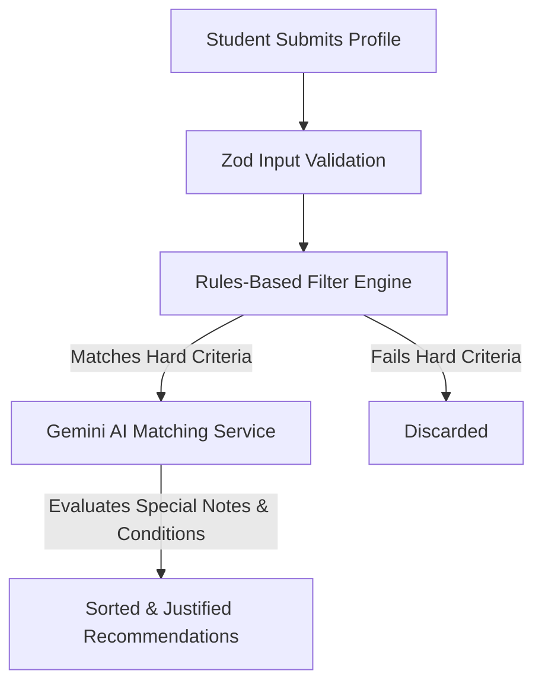

# 🎓 ScholarAI: Smart Scholarship Discovery Engine

Welcome to **ScholarAI**! This platform helps students instantly match with scholarships they actually qualify for, using a combination of a fast local rules-matching engine and Google's Gemini AI to analyze complex qualitative conditions.

---

## 🛠️ Technology Stack

Here are the technologies driving this application:


---

## 💡 How ScholarAI Solves the Problem

Many scholarships go unused because their eligibility conditions are hidden in complex legal rules (e.g., *"must be the first graduate in the family"*). 



1. **The Form**: The student inputs their academic, financial, and personal details, along with any special background notes (e.g., *"parent is a farmer, first graduate"*).
2. **The Hard Filter**: The backend performs a fast check against absolute constraints (income limits, marks requirements, states, and gender).
3. **The AI Evaluation**: The backend feeds the remaining scholarships to Gemini. Gemini reviews the student's background against the scholarship's special conditions, calculates a compatibility score (0-100), and generates a personalized explanation showing exactly why they match.

---

## 📁 Project Structure

This repository is organized as a clean workspace directory containing the frontend client and the backend server:

```
ScholarAI/
├── frontend/             # 💻 React client website app
│   ├── src/
│   │   ├── components/   # Input controls & profile form sections
│   │   ├── pages/        # Home form page & Result dashboard page
│   │   └── constants/    # Category, gender, and state choices list
│   └── package.json
└── backend/              # ⚙️ Express server API
    ├── src/
    │   ├── controllers/  # API route request handler
    │   ├── services/     # Filtering, JSON load, & Gemini AI integrations
    │   ├── validation/   # Zod body validation schema parser
    │   └── server.ts     # Main startup file
    └── package.json
```

---

## 🚀 How to Run the App (Beginner-Friendly)

Follow these simple steps to run both the frontend and backend servers on your local computer.

### Step 1: Clone and Configure Environment Files
1. Copy the template configuration file in the **backend** directory:
   * Go into the `backend/` folder.
   * Duplicate the `.env.example` file and rename it to `.env`.
   * Add your Gemini API key (get one for free at [Google AI Studio](https://aistudio.google.com/)):
     ```env
     GEMINI_API_KEY=your_actual_key_here
     ```
2. Copy the template configuration file in the **frontend** directory:
   * Go into the `frontend/` folder.
   * Duplicate the `.env.example` file and rename it to `.env` (it is pre-configured with the default local backend port `5000`).

---

### Step 2: Start the Backend Server
Open your terminal (PowerShell or Bash) and run:
```bash
cd backend
npm install
npm run dev
```
> [!NOTE]
> The terminal will display: `🚀 Server running on http://localhost:5000`. Keep this terminal window open!

---

### Step 3: Start the Frontend App
Open a **new** terminal window and run:
```bash
cd frontend
npm install
npm run dev
```
> [!TIP]
> The terminal will display a local link. Open [http://localhost:5173/](http://localhost:5173/) in your web browser.

---

## 🧪 Try a Test Match!
Once you open [http://localhost:5173/](http://localhost:5173/) in your browser, try filling out these fields to see the AI matching in action:
* **State**: Select **Tamil Nadu**.
* **Course Type**: Select **Engineering**.
* **Special Notes**: Type: *"I am the first graduate in my family. My parent is a farmer. I need support to buy standard books."*
* Click **Generate AI Recommendations** and watch the engine match you with the **Tamil Nadu First Graduate Scholarship** and highlight the customized AI Insight explanation!
